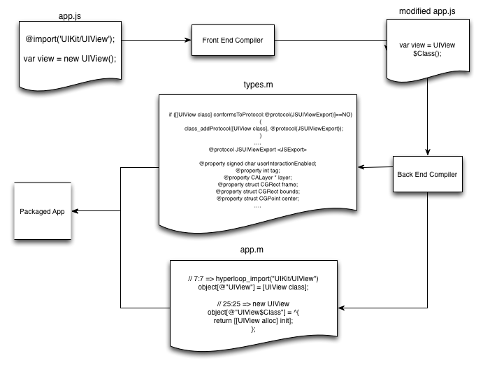

# Hyperloop

## Purpose:

This is a brief description of how hyperloop as of 9/12/13.  Since this is a rapidly changing prototype, the details of hyperloop may change at any time.

## Components:

The following are the main components of hyperloop and a brief description on its roles.

### CNI (Common Native Interface)
This is a Javascript DSL that allows us to define native elements like classes, interfaces, imports etc from Javascript.  With CNI, we have a common way to create, and invoke native components.

### Front End AOT
The front end compiler creates a Javascript AST and transforms the AST by converting CNI elements like @import to hyperloop_import.  During the AST generation process, the compiler also keeps track of the different import calls so we can use this information during the native code generation in the back end compiler.

### Back End AOT
The back end compiler is responsible for generating the respective native components that allow things like imports from the CNI layer to be exposed to Javascript.  The metabase is used to determine the methods and properties that need to be exposed per import.  For example, if the JS source references a native view, we use the metabase to determine the methods and properties for the native view class.

### Metabase
The metabase provides information on all the class, methods, and properties that are exposed in the corresponding native sdk.  The metabase provides rich metadata on the exposed APIs, like methods, properties, type, and inheritance information.

## Source Files:

### lib/hyperloop.js
This file provides all the entry functions to interact with hyperloop.  Currently, the main commands include 'compile' and 'package'.  The compile phase includes the following steps:
* Loop through all the files in project
* Create SourceFile objects for each file
* Run all files through compiler.js
* Run all files through codegen.js

### lib/compiler.js
This file is responsible for most of the front end compiler work.  The front end compiler creates an AST from the Javascript source and walks it to gather the CNI specific symbols.  Here is what the compiler currently does.
* Run regex replacement to convert @import to hyperloop_import
* Walk the Javascript AST and store all the symbols like hyperloop_import into the sourceFile object.
* Create a source map for the modified JS

### lib/<platform>/codegen.js
Platform specific native files are generated here.  This is the entry point to the back end compiler.  Using the sourceFile object from the front end compiler, native files are generated to expose APIs accordingly.  The JSExport mechanism is used to expose these APIs so they can be referenced in Javascript.  During we code generation phase, it always verifies that the metabase is available, and will create it when it does not exist.  Outline of what the generate() method does:

* Grab all the system framework libs and cache them
* Loop through list of sourceFiles and gather CNI symbols that need to be used during native file generation
* Ensure metabase is available, and create it if it's not
* Validate CNI symbols against metabase to make sure they are valid
* (iOS) Generate types.m and types.h based on the CNI symbols.  This includes declaring JSExport protocols to the APIs used, and adding the protocol to existing classes.  For example, if we wanted to expose UIViewController, we would need to create a JSUIViewControllerExport protocol with all the methods from UIViewController, and call class_addProtocol to add JSUIViewControllerExport to UIViewController.  This lets JSCore know what to expose when we do something like: object[@"UIViewController"] = [UIViewController class];
* Generate  native files (.m and .h for iOS) to expose the APIs used.  This is where we include things like "object[@"UIViewController"] = [UIViewController class];" as mentioned in the previous step.
* Compile the generated native files and create a universal library

### lib/<platform>/packager.js
This file packages the app, and launches it.  For iOS, it will launch the app in a simulator.  Note that the generated js files are not included in the packaged app.

## Process:

The following flowchart shows a simple CNI file, and what it generates during the AOT compile process.
